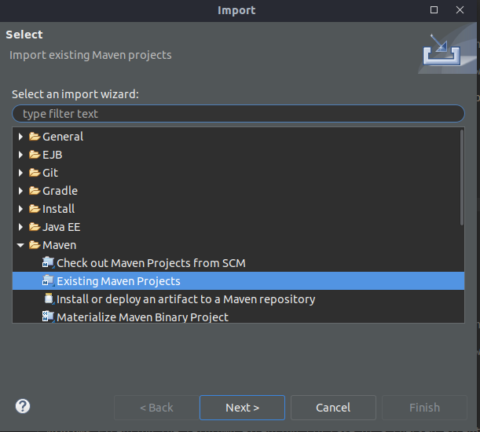
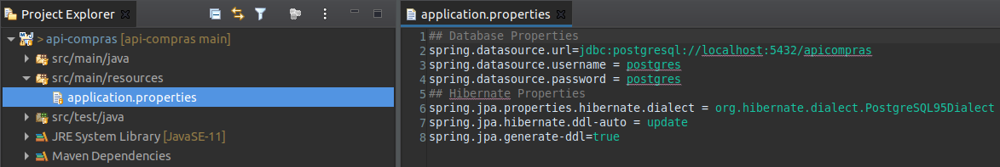
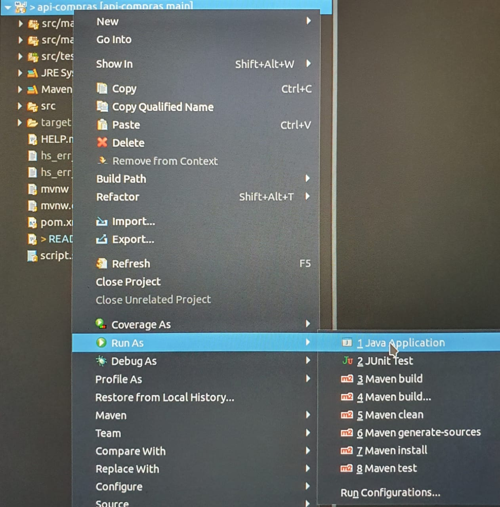

# api-compras

Api de compras feita em Java, Springboot e PostgreSQL

# Instalação

Pacotes utilizados (Ubuntu 20.04)

```bash
sudo apt install postgresql-client-12 postgresql-client-common postgresql postgresql-contrib openjdk-11-jdk
```

Configurar a senha do Postgres
```
sudo -u postgres psql
```
Depois ```\password``` para configurar a senha (padrão ```postgres```).

Após isso, crie o banco de dados
```
sudo -u postgres createdb apicompras
```

# Inicialização

Clone o projeto 
```
git clone https://github.com/Donwaztok/api-compras
```

## Eclipse

Importe como um Projeto Maven



Caso necessário, altere os dados de conexão com o banco em Application.properties



Para executar, clique com o botão direito na aplicação > Run As > Java Application



## Terminal

Compile os pacotes

```
mvn package
mvn compile war:war
```

E execute 

```
java -jar target/*.jar target/*.war
```

# Teste

Para os testes é possível utilizar a documentação em Swagger
http://localhost:8080/swagger-ui.html
